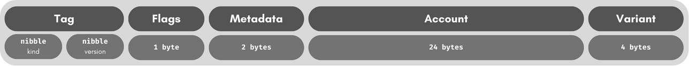
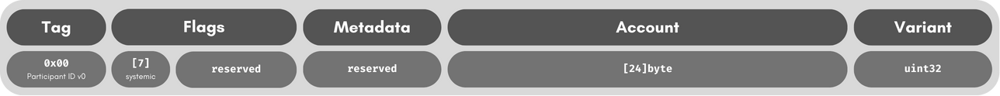
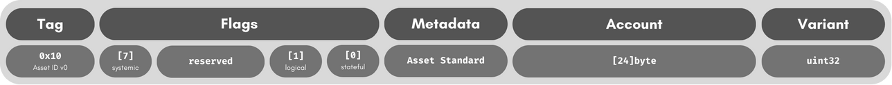
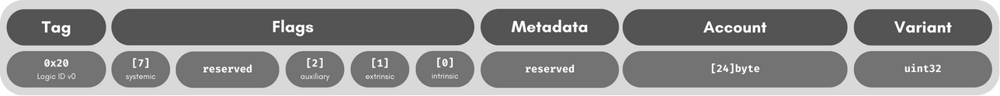

# Identifiers Specification

## Introduction
The MOI Protocol uses a standardised identification system for all account types.
This specification defines the structure and encoding of identifiers used in the MOI Protocol.

## Identifier
An identifier is a 32-byte value that can be used to uniquely identify an account in the MOI Protocol.
The underlying account may be a participant, an asset or a logic. This specification leaves room for 
expansion to other account types such as files. 

|  Identifier Tags  | Tag Value |     Kind      | Version |    Flags     |    Metadata    |
|:-----------------:|:---------:|:-------------:|:-------:|:------------:|:--------------:|
| Participant ID v0 |  `0x00`   | `Participant` |    0    | `0b01111111` |      n/a       |
|    Asset ID v0    |  `0x10`   |    `Asset`    |    0    | `0b01111100` | Asset Standard |
|    Logic ID v0    |  `0x20`   |    `Logic`    |    0    | `0b01111000` |      n/a       |

Every identifier regardless of the kind are structured as follows:  

### Tag
The 1st byte of the identifier is used to determine the kind of account the identifier represents.
This byte is called the **Tag** and comprises the kind (4 bits) of and the version (4 bits) of the 
identifier. While the kind of the identifier determines the account type, the version is used to 
determine the encoding and structure of the rest of the identifier. Refer to the table above for 
the supported identifier tags and their corresponding properties.

This specification allows for up to 16 different kinds of identifiers and 16 different versions for each kind. 
While this headroom is excessive for current requirements, and could be optimized further, using the nibble as
the smallest unit, allows for easily recognizing the kind and version of an identifier in its hexadecimal format.

### Flags
The 2nd byte of the identifier is used to store flags that are specific to the kind of identifier.
For a given identifier tag, a flag mask is used to determine which flags can be set. Refer to the table
above for the flags mask for each identifier tag.

Flags are indexed by positions from 7 for the MSB to 0 for the LSB. The implementation should protect 
unsupported flags from being set and default to false if accessed regardless of the underlying value.

Refer to individual identifier types below for flags supported specifically for them. Some flags are 
supported commonly across all identifier kinds:
- **Systemic**: The MSB of the identifier flags is shared for all identifier 
kinds and denotes whether the account for the identifier is a system account.

### Metadata
The third and fourth bytes of the identifier are used to store metadata that is specific to the kind of 
identifier. This metadata is used to store additional information about the identifier. Refer to the table 
above for the metadata encoded for each identifier tag.

### Fingerprint
The middle 24 bytes of the identifier (between the 5th and 28th bytes) are used to store a unique fingerprint 
which represents a unique value to distinguish between shared entities in the MOI Protocol. 

Multiple identifiers can have the same fingerprint but different tags, flags and metadata. This allows for
different entities to share the same fingerprint but have different properties.

### Variant
The last 4 bytes of the identifier are used to store a 32-bit variant ID for the identifier. The variant is 
used to differentiate between different variations of the same entity with the same fingerprint. For example, 
an asset may use the variant ID for each edition of an NFT.

The exact usage of the variant ID with an identifier kind and its implications on account and entity handling 
are left to MOI Protocol and are outside the scope of this specification.

Any implementation should allow checking if an identifier is a variant. 
This is true if the identifier has non-zero variant ID.

#### Deriving a Variant
Any implementation of this specification should allow for deriving a variant identifier.
- Derivation should only be allowed from zero-variant identifiers.
- Derivation can only be performed to a non-zero variant identifier.
- Derivation should allow for setting the variant ID to a specific value.
- Derivation should allow for flags to be set and unset.
- Derivation should not allow modification of unsupported flags.

## Encoding & Formatting
### POLO Encoding
When encoding an identifier in POLO, the identifier is encoded Bytes value with the `Word` wire tag.
### JSON Encoding
When encoding an identifier in JSON, the identifier is encoded as a hexadecimal string with the `0x` prefix
### HEX Encoding
When encoding an identifier as a Hexadecimal, the identifier is encoded as a hexadecimal string without the `0x` prefix

## Participant ID

### Participant Variants
Participant Variant IDs are used when context inheritance is used to create a sub-account from a parent account.
This is useful for allocating a selection of resources to a sub-account for use by an application.

### Participant Flags
As of v0, Participant ID does not have any specialised flags and only uses the systemic flag at the MSB.

## Asset ID

### Asset Standard
The Asset Standard is metadata value for assets to specify what standard of functionality they support. 
This is useful for identifying the type of asset and the operations that can be performed on it. For example,
MAS0 (standard 0) represents a simple fungible token whose supply can be adjusted by its controller.

### Asset Variants
Asset Variant IDs are used to differentiate between different editions of the same asset. This is useful 
for non-fungible tokens that have multiple editions under the same asset account or NFT Project.

### Asset Flags
As of v0, Asset ID supports the following specialised flags apart from the common flags:
- **Stateful**: The LSB (0th Index) of the flags is used to denote whether the asset is stateful or stateless.
This is useful for assets that have stateful properties such as a variable supply and require additional handling.
- **Logical**: The 1st Index of the flags is used to denote whether the asset is logical or not, i.e., whether the
business logic for the asset is handled by a separate logic. 

## Logic ID

### Logic Variants
Logic Variant IDs are used to differentiate between different versions of the same logic. This is useful for
upgrading the logic and having independent references to different versions of the same logic while still being
stored and managed under the same account.

### Logic Flags
As of v0, Logic ID supports the following specialised flags apart from the common flags:
- **Intrinsic**: The LSB (0th Index) of the flags is used to denote whether the logic has an intrinsic state
- **Extrinsic**: The 1st Index of the flags is used to denote whether the logic has an extrinsic state
- **Auxiliary**: The 2nd Index of the flags is used to denote whether the logic is an auxiliary deployment 
to some other object like asset, participant or file.

